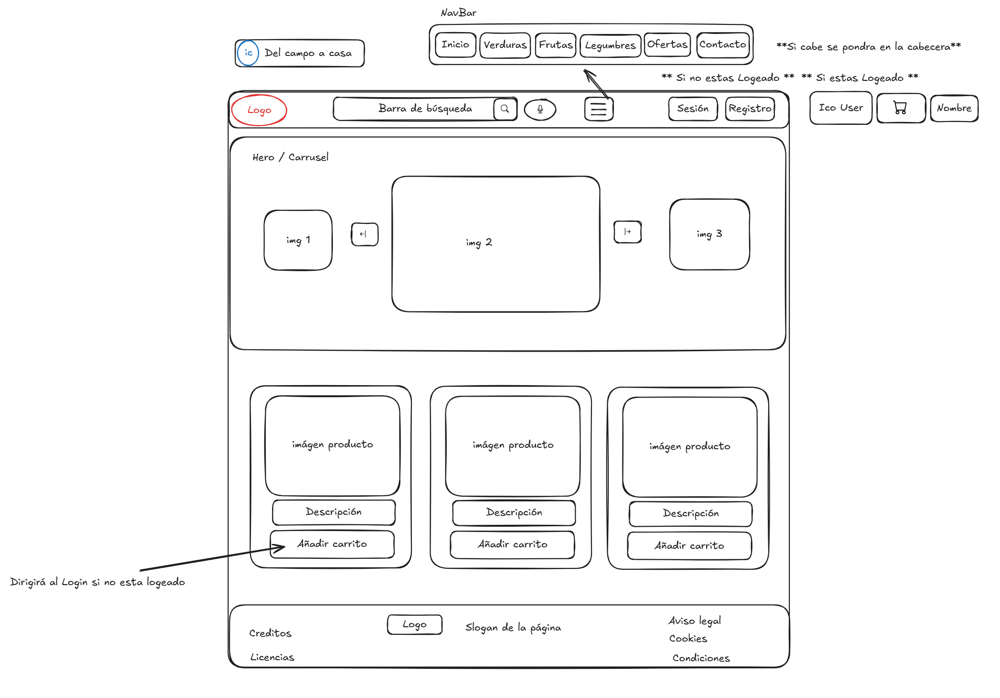
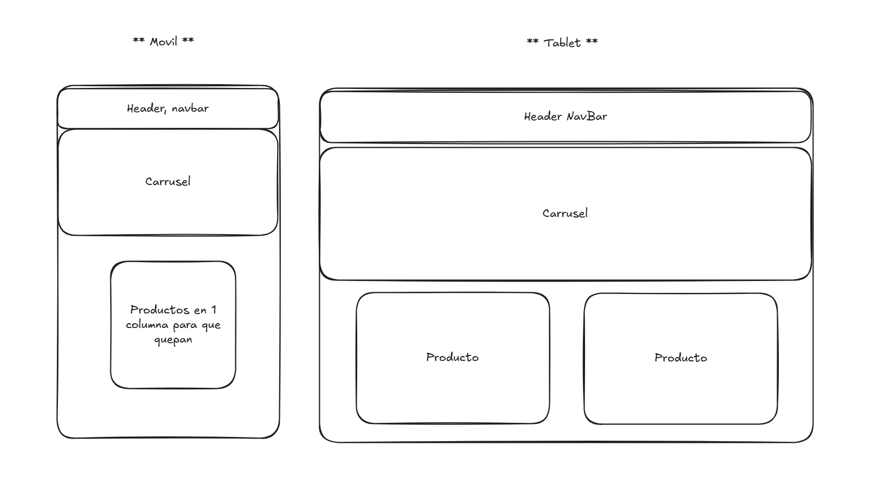

# Diseño Web - Mockup / Wireframe

## Descripción General
Este documento describe la estructura visual (Wireframe) del sitio web "Del Campo a Casa", diseñado utilizando la herramienta **Excalidraw**.

## Estructura de Página (Layout)

### Visualización Desktop

### Visualización Móvil y Tablet

### 1. Cabecera (Header)
- **Top Bar (Desktop):**
  - Izquierda: Logotipo "Del Campo a Casa" + Icono Hoja.
  - Centro: Barra de búsqueda (Input text) + Botón Micrófono (Reconocimiento voz).
  - Derecha:
    - Enlace "Inicio de Sesión" / "Registro" (Si no logueado).
    - Icono Usuario + Nombre + Icono Carrito (Badge con número items) (Si logueado).

### 2. Navegación (Navbar)
- Barra horizontal debajo de la cabecera.
- Enlaces: Inicio | Verduras | Frutas | Legumbres | Ofertas | Contacto.

### 3. Zona Principal (Main Content)

#### A. Sección Hero / Carrusel (Novedades)
- **Componente:** Carrusel de ancho completo.
- **Diapositivas (3):**
  1. Imagen: Cesta de verduras variadas. Texto: "Directo de la huerta a tu mesa".
  2. Imagen: Naranjas en árbol. Texto: "Temporada de Cítricos - 20% Dto".
  3. Imagen: Agricultor trabajando. Texto: "Apoya al comercio local".

#### B. Catálogo de Productos (Grid)
- **Grid Responsivo:**
  - Móvil: 1 columna.
  - Tablet: 2 columnas.
  - Desktop: 3/4 columnas.
- **Tarjeta de Producto (Card):**
  - Imagen superior.
  - Título (Ej. "Patatas Agria").
  - Precio ("0.90€ / kg").
  - Agricultor ("Finca Los Alamos").
  - Botón: "Añadir" (Icono +). Deshabilitado si no logueado (o redirige a login).

### 4. Pie de Página (Footer)
- **Columna 1:** Logo + Slogan.
- **Columna 2:** Enlaces Legales (Aviso Legal, Cookies, Condiciones, Licencias).
- **Columna 3:** Contacto (Email, Teléfono, Redes Sociales).
- **Columna 4:** Créditos "Desarrollado por [Tu Nombre] - Proyecto DIW".

## Flujos de Usuario

### Flujo de Compra
1. Usuario navega por Home.
2. Hace click en "Añadir" en un producto.
3. **Si no logueado:** Modal/Alert "Debes iniciar sesión".
4. **Si logueado:** Animación de producto volando al carrito. Contador de carrito incrementa.

### Flujo de Registro
1. Click en "Registro".
2. Formulario: Nombre, Email, Contraseña (x2), Dirección, Checkbox "Acepto términos".
3. Validación en tiempo real (bordes rojos/verdes).
4. Submit -> Feedback "Registro completado" -> Auto Login.
