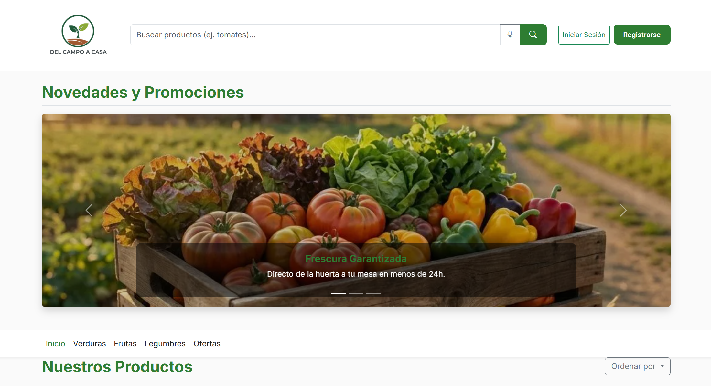
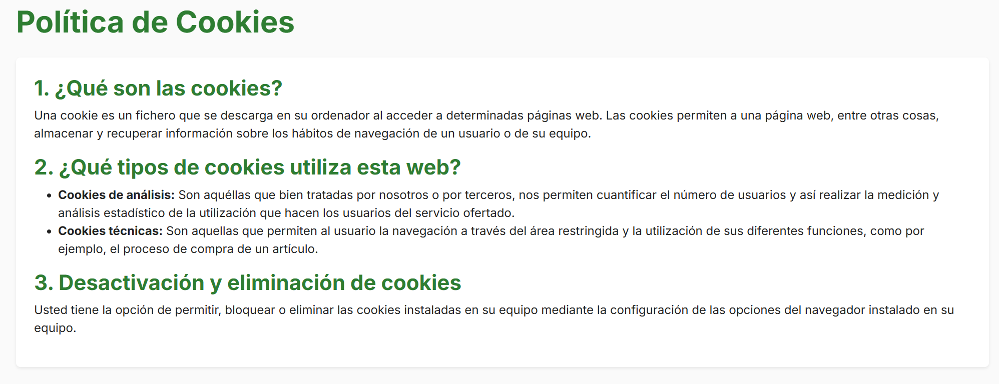
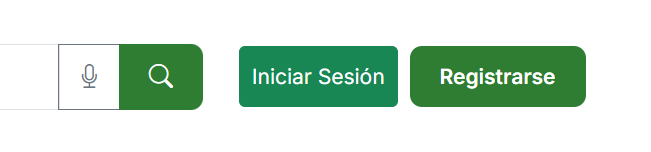
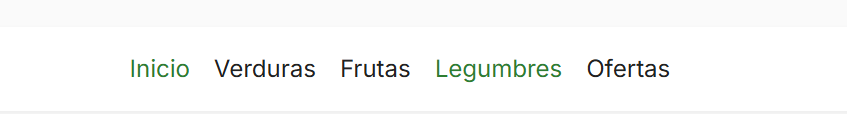
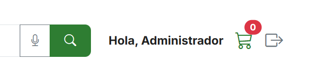
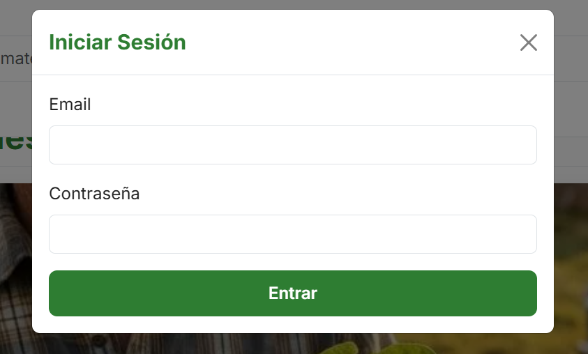
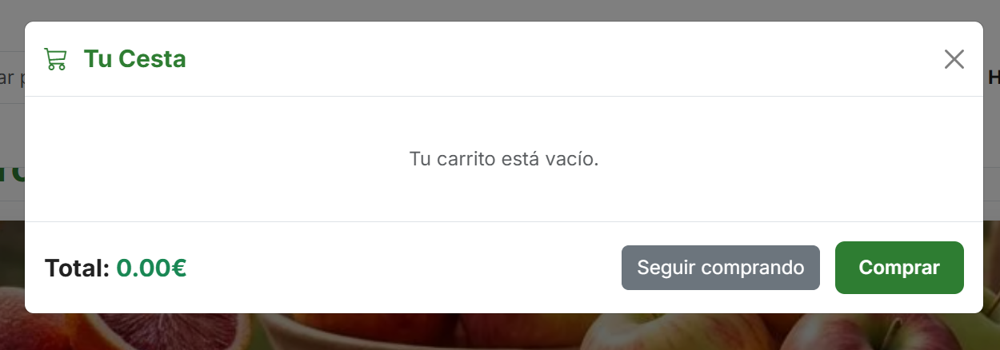

# Guía de Estilos Visuales - Escaparate Virtual "Del Campo a Casa"

Este documento visual documenta los estilos implementados en el proyecto.

---

## 1. Paleta de Colores
Colores inspirados en la naturaleza para transmitir frescura y calidad.

| Variable | Color | Código Hex | Uso Principal |
| :--- | :--- | :--- | :--- |
| `--color-primario` | Verde Campo | `#2E7D32` | Encabezados, Botones primarios, Bordes activos |
| `--color-tierra` | Marrón Tierra | `#795548` | Subtítulos, detalles de agricultores |
| `--color-fondo` | Crema Suave | `#FAFAFA` | Fondo general de la página |
| `--color-texto` | Gris Oscuro | `#212121` | Texto principal, enlaces |
| `--color-acento` | Naranja Cítrico | `#FF9800` | Etiquetas de oferta, llamadas a la acción secundarias |
| `--color-alerta` | Rojo Tomate | `#D32F2F` | Mensajes de error |

### Muestra Visual

---

## 2. Tipografía
Tipografía moderna y legible para pantallas.

*   **Fuente Principal:** 'Inter', system-ui, sans-serif.
*   **Encabezados (H1-H6):** `font-weight: 700`, Color Primario.
*   **Cuerpo:** `font-weight: 400`, Color Texto.

### Jerarquía Tipográfica

---

## 3. Botones (Buttons)
Estilos para elementos interactivos.

*   **Botón Primario (`.btn-primario`):**
    *   Fondo: `#2E7D32`
    *   Texto: Blanco
    *   Border-radius: `8px`
    *   Hover: `#1B5E20`

*   **Botón Acento (`.btn-acento`):**
    *   Fondo: `#FF9800`
    *   Texto: Blanco (Bold)

### Visualización de Botones

---

## 4. Tarjetas de Producto (Cards)
El componente principal para mostrar los productos.

*   **Contenedor:** Fondo blanco, sombra suave (`box-shadow`), bordes redondeados (`12px`).
*   **Imagen:** Altura fija (`200px`), `object-fit: cover`.
*   **Interacción:** Efecto de elevación (`translateY`) al pasar el ratón.
*   **Datos:** Precio en color primario y negrita.

### Ejemplo de Tarjeta

---

## 5. Navegación (Navbar)
Barra de navegación limpia y funcional.

*   **Estilo:** Fondo blanco, sombra sutil.
*   **Enlaces:** Color texto, cambio a color primario en hover/active.

### Barra de Navegación

---

## 6. Iconografía y Elementos Flotantes
Detalles adicionales de la interfaz.

*   **Carrito Flotante (`.carrito-flotante`):** Botón circular fijo en la esquina inferior derecha.

### Iconos

---

## 7. Modales y Ventanas Emergentes
Diseño de las interacciones superpuestas.

### Modal de Inicio (Login/Registro)
Formulario limpio con enfoque en la facilidad de acceso.

### Modal del Carrito
Vista resumen de la compra con listado de productos y totales.

